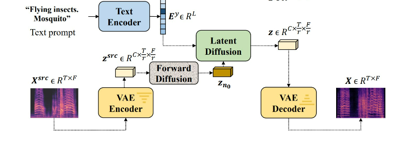

# 🔊 MusicCLAP
- [How it works](#how-it-works)
- [Examples](#examples)
- [Prepare Python running environment](#prepare-python-running-environment)
  * [Download checkpoints](#download-checkpoints)
- [Play around with the code](#play-around-with-the-code)
- [Inference with the model](#inference-with-the-model)
- [Train the model using your own dataset](#train-the-model-using-your-own-dataset)
- [Cite this work](#cite-this-work)

# How it works


# Examples

# Prepare Python running environment

```shell 
# Create conda environment
conda create -n audioclip python=3.10
conda activate audioldm_train
# Clone the repo
git clone https://github.com/k1064190/MusicCLAP.git; cd MusicCLAP
# Install running environment
pip install poetry
poetry install
```

## Download checkpoints
1. Download checkpoints from Google Drive: [link](https://drive.google.com/file/d/1T6EnuAHIc8ioeZ9kB1OZ_WGgwXAVGOZS/view?usp=drive_link). The checkpoints including pretrained VAE, AudioMAE, CLAP, 16kHz HiFiGAN, and 48kHz HiFiGAN.
2. Uncompress the checkpoint tar file and place the content into **data/checkpoints/**
3. Download the MusicCLAP checkpoints from huggingface: [link](https://huggingface.co/Noename/AudioLDM-MUSIC/tree/main). Place them in the **ckpt/**

If the structure is not correct or partly missing. You will see the error message.


# Play around with the code

## Inference with the model
Use the following syntax:

```shell
python3 audioldm_train/infer.py 
--config_yaml ckpt/audioldm_original_medium.yaml 
--prompt <The-text-you-want-to-generate-audio> 
--output_dir <The-path-to-save-the-audio> 
--style <the-original-audio-for-style-transfer>
--reload_from_ckpt ckpt/audioldm_music_medium.ckpt
--transfer_strength <0.0-1.0>
```
You can write several prompts and styles but their number must be the same. The model will generate the audio by combining the prompts and styles.

## Train the model using your own dataset
Super easy, simply follow these steps:
1. If you have MIDI files, you can use the following command to convert them to the wav files.
2. You must firstly put the all midi files to **extracted_instruments** folder.
3. Then run the following command to convert them to the wav files.
```shell
python convert.py --duration 10 --processes 8
```
4. Converted wav files will be saved in the **wavs_10s_all** folder.

After that, you must build your dataset with the following steps:
1. Prepare the metadata with the same format as the provided AudioCaps dataset. You can do it by using audio_to_dataset.py
2. Register in the metadata of your dataset in **data/dataset/metadata/dataset_root.json**
3. Use your dataset in the YAML file.
4. Train the model with the following command:
```shell
python audioldm_train/train/latent_diffusion.py -c audioldm_train/config/2023_08_23_reproduce_audioldm/audioldm_original_medium.yaml --reload_from_ckpt data/checkpoints/audioldm-m-full.ckpt
```
